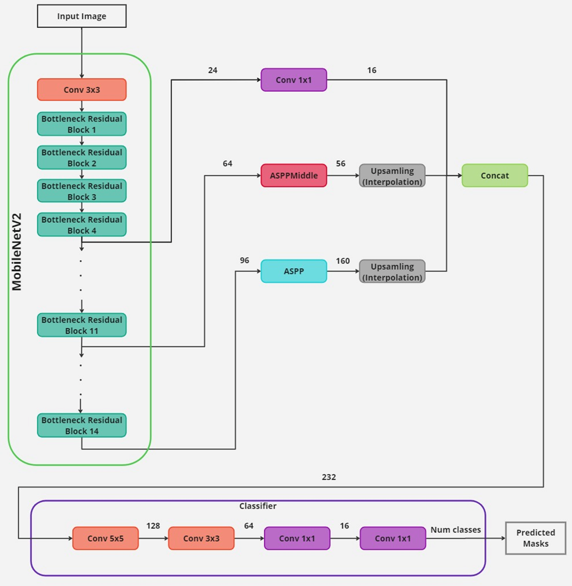
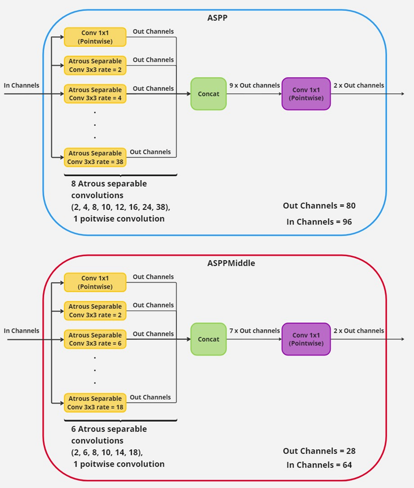
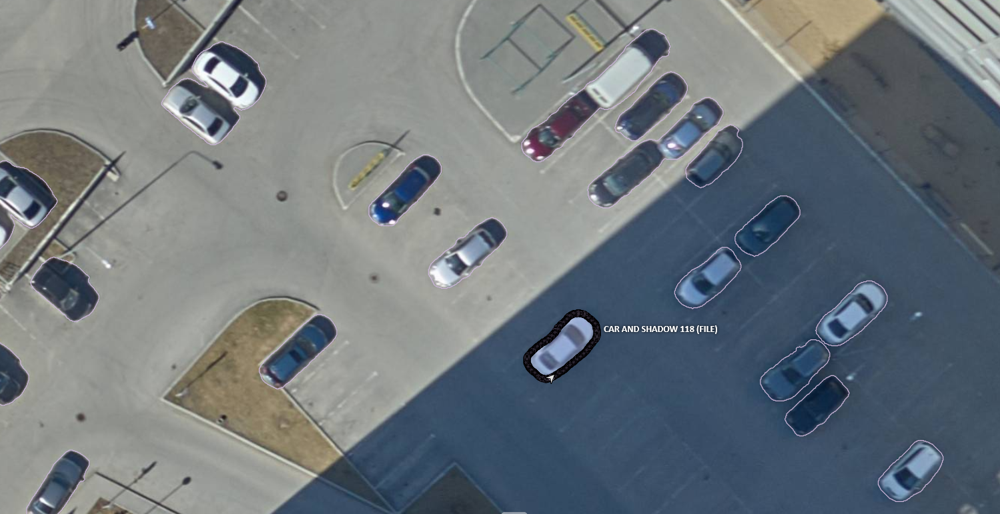

# Система сегментации объектов на аэрофотоснимках

Выпускная квалификационная работа — прототип веб-сервиса для семантической сегментации объектов на аэрофотоснимках с использованием нейронной сети DeepLabV3+ на базе MobileNet.

***

## Описание

Система предоставляет веб-интерфейс для загрузки аэрофотоснимков и их обработки моделью глубокого обучения. Результатом обработки является бинарная маска сегментации, выделяющая целевые объекты на снимке.

Стек технологий:

- **Backend**: FastAPI (Python 3.14)
- **Модель**: DeepLabV3+ / MobileNet (`torch`)
- **Шаблоны**: Jinja2
- **Веб-сервер**: Nginx (reverse proxy + SSL)
- **Контейнеризация**: Docker, Docker Compose

***

## Демонстрация

<video src="https://github.com/user-attachments/assets/3e4ccfc1-6c5f-4c97-aa97-4ee8bbb3d703" controls width="100%"></video>


### Метрики

Модель протестирована на тестовых снимках того же города, что и обучающая выборка.

| Метрика | Значение |
|---------|----------|
| IoU (тестовая выборка) | **87%** |
| Скорость инференса (сегментация) | **0.047 с** |
| Скорость инференса (инпейнтинг) | **~10 с** (зависит от числа объектов) |

Время работы инпейнтинг-модели варьируется в зависимости от количества объектов на снимке, требующих удаления.

***

## Архитектура модели

### DeepLabV3+

В качестве модели семантической сегментации используется **DeepLabV3+** с облегчённым энкодером **MobileNetV2**. Архитектура выбрана с учётом требований к производительности на устройствах без выделенного GPU.

Модель принимает аэрофотоснимок и возвращает попиксельную маску сегментации с числом классов, задаваемым через конфигурацию (`NUM_CLASSES = 2` для бинарной задачи).

#### Общая схема сети



Сеть состоит из трёх частей:

**Энкодер — MobileNetV2.** Входное изображение проходит через свёрточный слой Conv 3×3, после чего обрабатывается 14 инвертированными остаточными блоками (Bottleneck Residual Block). С промежуточных слоёв снимаются три карты признаков с 24, 64 и 96 каналами соответственно — они передаются в декодер.

**Многомасштабный декодер (ASPP + ASPPMiddle).** Карты признаков обрабатываются параллельно двумя модулями атрусовой пространственной пирамиды с объединением (ASPP):
- карта с 96 каналами поступает в основной модуль **ASPP** (выход — 160 каналов);
- карта с 64 каналами поступает в промежуточный модуль **ASPPMiddle** (выход — 56 каналов);
- карта с 24 каналами сжимается точечной свёрткой Conv 1×1 до 16 каналов.

Все три результата приводятся к единому пространственному разрешению интерполяцией и объединяются конкатенацией (итого 232 канала).

**Классификатор.** Объединённый тензор последовательно обрабатывается четырьмя свёртками (Conv 5×5 → 128 к., Conv 3×3 → 64 к., Conv 1×1 → 16 к., Conv 1×1 → Num classes) и выдаёт финальную маску предсказания.

#### Модули ASPP и ASPPMiddle



Оба модуля построены по одному принципу: входной тензор параллельно обрабатывается точечной свёрткой Conv 1×1 и набором **атрусовых разделяемых свёрток Conv 3×3** с различными коэффициентами дилатации, затем результаты конкатенируются и сжимаются точечной свёрткой.

| Параметр | ASPP | ASPPMiddle |
|----------|------|------------|
| In channels | 96 | 64 |
| Out channels | 80 | 28 |
| Дилатации атрусовых свёрток | 2, 4, 8, 10, 12, 16, 24, 38 | 2, 6, 8, 10, 14, 18 |
| Число параллельных ветвей | 9 (8 атрусовых + 1 pointwise) | 7 (6 атрусовых + 1 pointwise) |

Использование широкого диапазона коэффициентов дилатации позволяет модели учитывать контекст на разных масштабах без увеличения числа параметров.

***

## Датасет и разметка

Обучающий датасет составлен из аэрофотоснимков и размечен в системе **CVAT** (Computer Vision Annotation Tool), развёрнутой локально. Разметка выполнена в формате полигональных масок по классу объектов.

Пример снимка с нанесёнными аннотациями:



Каждый объект обведён полигоном вручную; итоговые маски экспортированы и использованы в качестве ground truth при обучении.

***

## Инпейнтинг

Для задачи восстановления областей изображения (удаление объектов, заполнение фона) в пайплайне используется готовая предобученная модель инпейнтинга. Модель подключается без дообучения: маска сегментации, полученная DeepLabV3+, передаётся в неё как указание на область заполнения. Это позволяет решать задачу «удалить объект и восстановить фон» без дополнительной разметки.

***

## Структура проекта

```
a-vkr/
├── app/
│   ├── main.py              # FastAPI-приложение, роуты
│   ├── ai.py                # Загрузка модели и инференс
│   ├── config.py            # Конфигурационные переменные
│   ├── networks/
│   │   └── modeling.py      # Архитектура DeepLabV3+
│   └── templates/
│       └── index.html       # Одностраничный интерфейс (Jinja2)
├── checkpoints/
│   └── *.pth                # Веса модели (не включены в репозиторий)
├── uploads/                 # Оригинальные загруженные снимки
├── processed/               # Результаты сегментации
├── nginx/
│   └── default.conf         # Конфиг Nginx
├── Dockerfile
├── docker-compose.yml
├── pyproject.toml
├── Makefile
└── README.md
```

***

## Требования

- Docker и Docker Compose
- Файл весов модели `.pth` в папке `checkpoints/`

Для локального запуска без Docker дополнительно:
- Python 3.14
- Poetry

***

## Быстрый старт

### С Docker (рекомендуется)

```bash
# Клонировать репозиторий
git clone <repo-url>
cd a-vkr

# Положить веса модели
cp /path/to/weights.pth checkpoints/train_phosphorusV11_2_1200.pth

# Запустить (первый раз генерируется SSL и dhparam — ~5 минут)
docker compose up --build

# Открыть в браузере
# https://localhost
```

> При первом запуске браузер покажет предупреждение о самоподписанном сертификате — нажмите «Дополнительно» → «Всё равно перейти».

### Локально без Docker

```bash
# Установить зависимости
make install

# Запустить в режиме разработки
make dev
```

Приложение будет доступно по адресу `http://localhost:8000`.

***

## Makefile

| Команда | Описание |
|---------|----------|
| `make install` | Установить зависимости через Poetry |
| `make dev` | Запустить сервер с автоперезагрузкой (`--reload`) |
| `make run` | Запустить в production-режиме |

***

## API

### `GET /`

Возвращает главную страницу интерфейса.

### `POST /api/process`

Принимает изображение, запускает инференс модели, возвращает URL оригинала и результата.

**Запрос:** `multipart/form-data`, поле `file` — изображение (JPG, PNG, WEBP).

**Ответ:**
```json
{
  "original_url": "/uploads/abc123.jpg",
  "processed_url": "/processed/abc123_processed.jpg"
}
```

***

## Конфигурация

Все параметры вынесены в `app/config.py`:

| Переменная | По умолчанию | Описание |
|------------|-------------|----------|
| `CHECKPOINT` | `checkpoints/*.pth` | Путь к файлу весов модели |
| `DEVICE` | `cpu` | Устройство для инференса (`cpu` / `cuda`) |
| `NUM_CLASSES` | `2` | Количество классов сегментации |
| `CROP_SIZE` | `3000` | Максимальный размер кропа при чтении снимка |
| `UPLOADS_DIR` | `uploads/` | Директория для оригинальных снимков |
| `PROCESSED_DIR` | `processed/` | Директория для результатов |

В Docker-окружении `UPLOADS_DIR` и `PROCESSED_DIR` переопределяются через переменные окружения на `/media/uploads` и `/media/processed` (shared volume между контейнерами FastAPI и Nginx).

***

## SSL-сертификат

Сертификат генерируется автоматически при первом запуске через одноразовый контейнер `ssl-init` и хранится в Docker volume `ssl_certs`. Повторная генерация не производится — сертификат сохраняется между перезапусками.

Для ручной генерации (вне Docker):

```bash
# Самоподписанный сертификат на 10 лет
openssl req -x509 -nodes -days 3650 -newkey rsa:2048 \
  -keyout /etc/ssl/cert.key \
  -out /etc/ssl/cert.crt \
  -subj "/C=RU/ST=Moscow/L=Moscow/O=VKR/CN=localhost"

# DH-параметры
openssl dhparam -out /etc/ssl/dhparam.pem 4096
```

***

## Подключение модели

Логика инференса находится в `app/ai.py`. Модель загружается один раз при старте приложения через lifespan-событие FastAPI и передаётся в обработчик через `app.state.model`.

Для замены модели:
1. Обновить архитектуру в `app/networks/modeling.py`
2. Положить новые веса в `checkpoints/`
3. Обновить путь в `app/config.py`

***

## Презентация
Ссылка на презентацию https://docs.google.com/presentation/d/1Qvwj1BH5LI65b9KdfHRuHZYihYmAmA91/edit?usp=sharing&ouid=117519297675945571237&rtpof=true&sd=true

## Лицензия

Проект разработан в рамках выпускной квалификационной работы.
